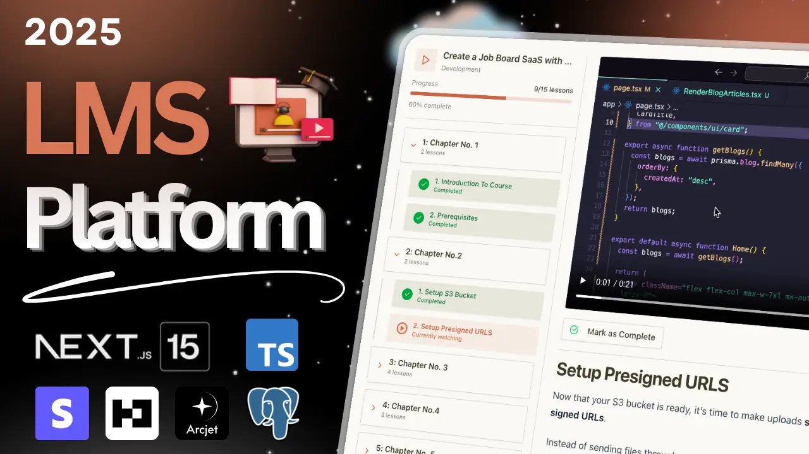

# Learnify - LMS Platform

## 🔥 Features

- 🔒 Authentication with Better-Auth (Email OTP & GitHub OAuth)

- 🛡️ Arcjet Security Protects against XSS, SQL injection, and other common attacks

- 📈 Progress Tracking

- 🧑‍💼 Admin Dashboard

- 👤 Customer Dashboard

- 🚫 Rate Limiting

- 🎥 Custom Video Player

- 📊 Beautiful Analytics

- 📁 File Uploads with S3 (Presigned URLs)

- ✅ Lesson Completion Tracking

- ⭐ Custom Dropzone

- 💳 Stripe Payment Integration

- 🖱️ Course Structure with Drag & Drop

- 📝 Custom Rich Text Editor
